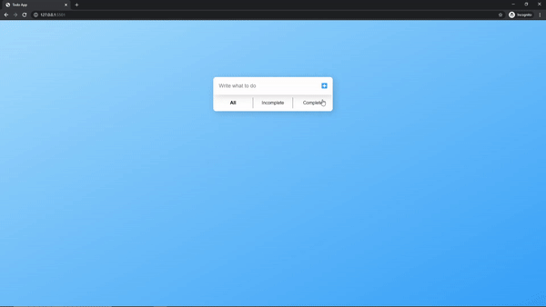

# Todo-App

This is a basic javascript project which includes a Todo App with all the basic functionalities such as:
- Adding Todos
- Deleting Todos
- Marking Todos as Complete
- Storing Todos to the local storage

## Showcase

